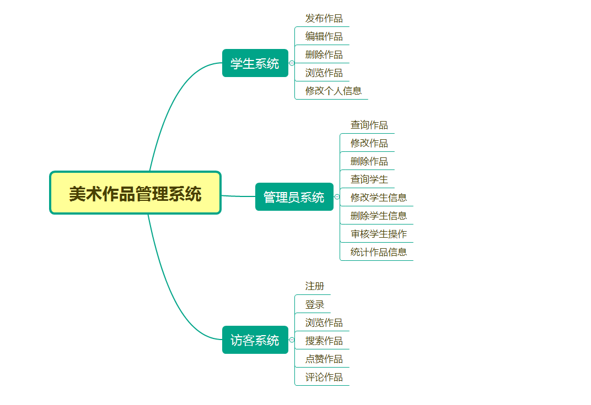

# 美术作品展示与管理系统

## 内容及要求
* 1．功能要求。至少完成以下基本功能：
	* （1）学生基本信息管理。信息包括：学号、姓名、性别、出生日期、年级、专业、照片…等。
	* （2）学生作品管理。信息包括：学号、作品名称、作品类别（如水彩画、水墨画、水粉画、油画、版画、工笔画、木刻、素描、书法、篆刻、雕塑等）、作品尺寸（包括长、宽、高，单位：cm）、创作日期、最高获奖名目、最高获奖等级、获奖日期、获奖证书照片、作品照片等。
	* （3）学生作品展示。按多种条件查询学生作品，并显示作品照片、名称、类别、尺寸、创作日期、获奖名目、获奖等级、获奖日期等信息。若有多件满足条件的作品，则设置前后翻页按钮，用鼠标前后选择。如能对作品照片放大、缩小，则更好。
	* （4）统计与汇总：
		* ① 按专业、年级统计每位学生的作品总数和获奖作品数。
		* ② 按专业、年级和作品类别，统计每位学生的各类作品总数和获奖作品数
	* （5）系统角色：
		* ① 管理员。需注册。能管理学生基本信息；对学生新增添、修改的作品信息进行审查和确认；进行各种统计汇总工作。 
		* ② 学生。需注册。能增、删、查、改自己的作品信息。
		* ③ 访客。无需注册。能按多种条件查询和欣赏学生作品。
* 2．特殊要求：
       主页面上除了有注册、登录等功能外，还要有提供访客查询浏览学生作品的功能。
* 3．设计要求：
	*（1）对标准信息（如专业、作品类别、最高获奖等级等）建立代码文件。
	*（2）标准信息的输入采用下拉式菜单选择输入。
	*（3）要有严格的输入数据合理性检查机制。
	*（4）要充分考虑多个数据文件之间的数据联系，实现多数据文件之间的关联操作。
	
## 结构图


## 安装

1. 安装tomcat
2. 将源码导入eclipse
3. 访问:```http://localhost/DrawingManager/install/install.jsp```